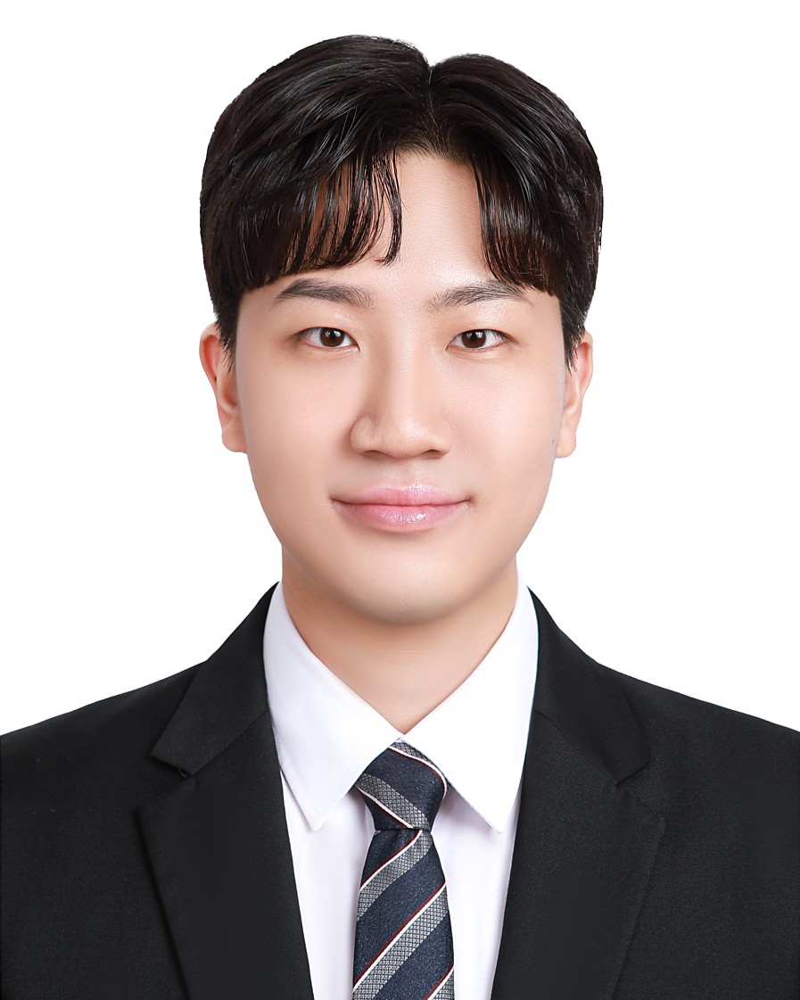

  

<h1 align="center">곽민재</h1>

  카메라, 라이다, IMU 기반 상태추정과 경로계획을 연구하고 
  실차와 임베디드 시스템에서 검증했습니다.

  <a href="https://neberrein.github.io/"><strong>연구개발 포트폴리오</strong></a>
  &nbsp;|&nbsp;
  <a href="mailto:tkkwak4@naver.com">Contact</a>

## Focus

- 센서융합과 상태추정: 카메라, 2D 라이다, IMU, DQN, IMM, Kalman Filter
- 자율주행과 경로계획: 객체 인지, Frenet, A-star, Dynamic VO, Pure Pursuit
- 임베디드와 시스템 소프트웨어: STM32, FreeRTOS, TouchGFX, ROS 2, WPF

## Selected work

| 프로젝트 | 담당 범위 | 대표 결과 |
|---|---|---|
| 강화학습 기반 카메라-라이다 센서융합 객체추적 | 연구기획, DQN-IMM 설계, 시뮬레이션, 현장검증 | 현장 위치 RMSE 20.6% 감소, 석사학위논문, ICROS 제1저자 발표, 특허 공동발명 |
| IFAC 2026 RoboRacer | 라이다 장애물 인지, Frenet 로컬 경로계획 | 56개 팀 중 16강 |
| IMU 기반 LSTM-FSM 주행상태 판별 | LSTM 학습, FSM 설계, ROS 통합, 실차검증 | 평균 후진 F1 99.52%, SCIE 공동저자 |
| STM32 초음파 표적탐지와 추적 | 센서 제어, FreeRTOS 구조, 상태기계, TouchGFX | 5개 태스크, 10개 메시지 큐, 7개 운용 상태 구현 |

## Research outputs

- 석사학위논문: 강화학습 기반 단안 카메라와 2D 라이다 센서융합 알고리즘
- 국제학술지 Measurement 공동저자: 반자율주행 농기계 주행상태 분류 기반 항법 시스템
- ICROS 2024, 2025 제1저자 구두발표
- 특허 공동발명: 차량 상태 추정 방법, 이를 수행하는 장치 및 기록매체

## Languages and tools

`Python` `C` `C++` `C#` `MATLAB` `ROS 2` `Gazebo` `RViz` `STM32` `FreeRTOS` `TouchGFX` `Linux` `Git`
